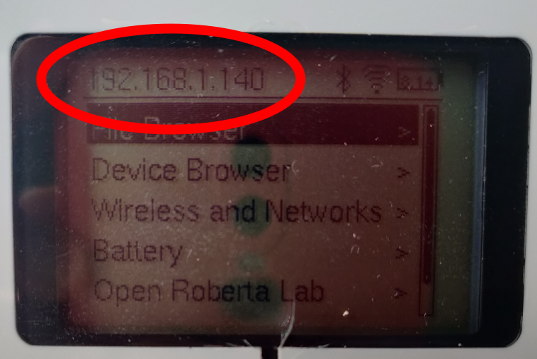
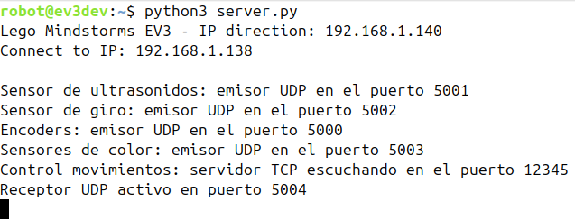

# eduROS2: robótica educativa Lego con ROS2
El proyecto se presenta por primera vez el 5 de noviembre de 2025 en las [ROSConEs](https://roscon.org.es/ROSConES2025.html) de Barcelona. La presentación utilizada para la ocasión se encuentra en [presentacion.pdf](presentacion.pdf).

Toda la documentación y vídeos del proyecto está enlazada desde este README, desde donde se detallan todos los pasos.

**El proyecto sigue en desarollo por lo que no se garantiza la pulcritud ni legibilidad del código. Parte del código está en Euskara.**

## Materiales utilizados
### Hardware

- **Lego Mindstorms EV3** (brick + sensores + motores) y cargador.
- **Dongle WiFi USB compatible con Lego Mindstorms EV3:** 
  - [NETGEAR WNA1100: adaptador USB inalámbrico N150](https://www.netgear.com/es/support/product/wna1100/), se puede comprar [aquí](https://www.ciudadwireless.com/netgear_wna1100-100pes_wireless_adaptador-p-4598.html)
- **Tarjeta microSD**  
  - Mínimo recomendado: 4 GB  
- **Ordenador con Linux**: Ubuntu 24.04
- **Joystick USB o Bluetooth**: DualShock 4

### Software

- **Sistema operativo [ev3dev](https://www.ev3dev.org/)** instalado en la tarjeta SD. Incluye Python3 para el robot.
- **Docker** instalado en el ordenador
- **ROS 2 Jazzy** instalado en nativo o **Docker** con la imagen personalizada ya preconfigurada: https://hub.docker.com/r/arambarricalvoj/eduros2_ev3/tags.
- **Herramienta de escritura de tarjetas SD**: [Rufus](https://rufus.ie/es/) o [USBImager](https://bztsrc.gitlab.io/usbimager/).
- **Cliente SSH** (ya incluido por terminal tanto en Linux como en Windows).

### Repositorio y scripts

- Código fuente del proyecto en el directorio `eduros2_lego/ws`
- Script de arranque [`run.sh`](run.sh) para desplegar el contenedor Docker
- Script [`server.py`](doc/config_lego/server.py) para ejecutar en el EV3
- Archivos de lanzamiento ROS 2:  
  - `display.launch.py`  
  - `zuzen_objektuarenganaino.py`

## 1. Instalar el sistema operativo [ev3dev](https://www.ev3dev.org/)
Descargar la imagen disponible: [aquí](https://github.com/ev3dev/ev3dev/releases/download/ev3dev-stretch-2020-04-10/ev3dev-stretch-ev3-generic-2020-04-10.zip).

Descomprimir el .zip y utilizando un software de escritura en tarjetas SD como [Rufus](https://rufus.ie/es/) o [USBImager](https://bztsrc.gitlab.io/usbimager/) volcar la imagen en una tarjeta SD de al menos 4GB.

Para utilizar ev3dev la tarjeta SD siempre tendrá que estar insertada en el brick EV3.

## 2. Conectar el Lego Mindstorms EV3 a una red WiFi.
Seguir los pasos del apartado "Conectar EV3 a Red WiFi" de [AQUí](doc/config_lego/wifi.md).

## 3. Conexión SSH con el robot.
Una vez que el robot está conectado a la misma red y nos ha proporcinado su dirección IP, podemos conectarnos a través de SSH. 
La contraseña es ``maker``. 

```bash
ssh robot@ev3dev.local
```

o bien 
```bash
ssh robot@DIRECCION_IP
```
La dirección IP del robot se muestra en su pantalla:



## 4. Arrancar ROS2 en Docker
Se utiliza ROS2 Jazzy en un contenedor Docker que ya incluye las librerías de Python necesarias.

La imagen Docker está accesible en la etiqueta "jazzy_v1.3_transformations" del siguiente repositorio en DockerHub: https://hub.docker.com/r/arambarricalvoj/eduros2_ev3/tags.

Para descargarla:
```bash
docker pull arambarricalvoj/eduros2_ev3:jazzy_v1.3_transformations
```

Una vez descargada la imagen, para facilitar el arranque se ha configurado el fichero [``run.sh``](run.sh) para desplegar el contenedor de Docker con el directorio del paquete de ROS2. 
Ejecutar el fichero:

```bash
./run.sh
```
El contenido del ejecutable es el siguiente:
```
xhost +local:*
docker run -e DISPLAY=$DISPLAY \
           -v /tmp/.X11-unix/:/tmp/.X11-unix/ \
           -v ./eduros2_ev3:/home/$USER/eduros2_ev3/ \
           -v /dev/input:/dev/input \
           --device-cgroup-rule='c 13:* rmw' \
           -p 5000:5000/udp \
           -p 5001:5001/udp \
           -p 5002:5002/udp \
           -p 5003:5003/udp \
           -p 5004:5004/udp \
           --device /dev/dri:/dev/dri \
           --device /dev/input:/dev/input \
           -it \
           --gpus all \
           --name eduros2_ev3_jazzy_v1.3_transformations \
           arambarricalvoj/eduros2_ev3:jazzy_v1.3_transformations

```

- ``xhost +local:*`` permite abrir herramientas gráficas del sistema del contenedor como si las estuviéramos abriendo en el propio sistema. Es necesario
pasar como parámetro la variable de entorno ``$DISPLAY``: ``-e DISPLAY=$DISPLAY`` y compartir su fichero con el contenedor: ``-v /tmp/.X11-unix/:/tmp/.X11-unix/``.

- ``-v ./eduros2_ev3:/home/$USER/eduros2_ev3/`` para compartir la carpeta ``./eduros2_ev3`` de nuestro ordenador con el contenedor en el directorio /home/$USER/eduros2_ev3/.

- ``--device /dev/input:/dev/input``, ``-v /dev/input:/dev/input`` y ``--device-cgroup-rule='c 13:* rmw'`` para permitir al contenedor acceder a dispositivos de entrada (por ejemplo, el mando a distancia). Se le otorga los permisos necesarios para interactuar con esos dispositivos.

- ``-p 500X:500X/udp`` exponen los puertos UDP indicados del contenedor al host para poder comunicarse por red con el robot desde dentro del contenedor.

- ``--device /dev/dri:/dev/dri`` para pasar al contenedor la aceleración gráfica necesaria para RVIZ2 (OpenGL, MESA, glx, iris)

- ``-it`` para abrir una terminal interactiva del contenedor.

- ``--gpus all`` para compartir las gpus con el contenedor.

- ``--name eduros2_ev3_jazzy_v1.3_transformations`` para dar un nombre al contenedor que se crea a partir de la imagen ``arambarricalvoj/eduros2_ev3:jazzy_v1.3_transformations``.


## 5. Activar ROS2
Desde la terminal del sistema en la que se encuentra ROS2, bien sea del contenedor de Docker o del propio sistema, ejecutar:

```bash
source /opt/ros/jazzy/setup.bash
```

Comprobamos que se ha activado correctamente imprimiendo la variable de entorno ``$ROS_DISTRO``. Si la salida no es vacía contiene una cadena identificativa de la distribución de ROS2, entonces se ha activado correctamente:
```bash
echo $ROS_DISTRO
```

## 6. Compilar y activar el paquete ``eduros2_lego``
Para ejecutar el programa tendremos que compilarlo. Desde terminal ir al workspace del paquete:
```bash
cd /home/$USER/eduros2_lego/ws
```

Compilar el workspace:
```bash
colcon build --symlink-install
```

Activar el workspace como overlay de ROS2:
```bash
cd /home/$USER/eduros2_lego/ws
source install/setup.bash
```

## 7. Ejecutar el servidor en el robot EV3
Copiar el script [server.py](doc/config_lego/server.py) en el robot mediante SSH. En una terminal del ordenador ejecutar:
```bash
scp /path/to/local/file username@remote_ip:/path/to/remote/directory
```

Ejemplo:
```bash
scp config_lego/server.py robot@192.168.1.140:/home/robot
```
En la terminal SSH del robot, cuando ya estamos conectados al robot, ejecutar:
```bash
python3 nombre_script.py.
```

Ejemplo:
```bash
python3 server.py
```

Esperar a que cargue y cuando lo indique por pantalla, el robot ya estará escuchando lo que el cliente (ordenador ROS2) le mande:


## 8. Ejecutar el programa ROS2 
En el ordenador de ROS2, nos aseguramos de que la overlay del proyecto en ROS2 esté activada:
```bash
cd /home/$USER/eduros2_lego/ws
source install/setup.bash
```
Para controlar el robot con el mando a distancia conectado por USB o Bluetooth al ordenador (ver ):
```bash
ros2 launch eduros2_lego display.launch.py use_controller:=true
```

El parámetro ```use_controller:=true``` activa el mando (joystick derecho), mientras que ```use_controller:=false``` desactiva el mando y activa las flechas del teclado. Usando el mando, si se pulsa el botón "X" o "A" se desactiva el joystick (UDP) y se controla mediante las flechas del mando (TCP).

Para ejecutar el programa en el que el robot avanza recto corrigiendo las desviaciones de trayectoria mediante el sensor de giro hasta detectar, con el sensor ultrasónicos, un objeto a menos de 15 cm (ver [video](videos/zuzen.mp4)):
```bash
ros2 launch eduros2_lego zuzen_objektuarenganaino.py
```
