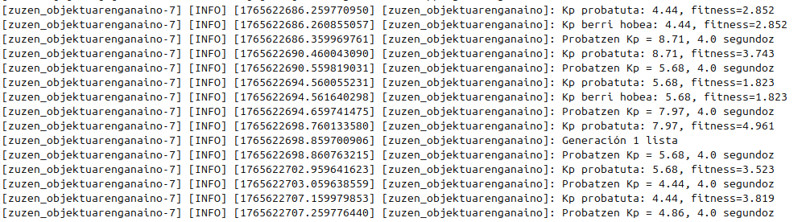

# eduROS2: robótica educativa Lego con ROS2
# SIME 2026: Técnicas de control inteligente aplicadas al robot educativo Lego Mindstorms EV3
Esta rama corresponde al proyecto final de la asignatura de Control Inteligente del Máster en Ingeniería de Sistemas y Control de la Universidad Complutense de Madrid y la UNED, curso académico 2025/2026.

En ``comunicacion_revista.pdf`` se encuentra el artículo presentado en el [II. Simposio CEA de Ingeniería de Control, de Modelado, Simulación y Optimización y de Educación en Automática](https://simposiocea-ic-mso-ea-2026.i3a.es/). Las siguientes secciones de este readme exlpican cómo ejecutarlo.

El directorio ``matlab/`` contiene los ficheros ``.m`` y ``.csv`` con los que se han construído las gráficas del artículo.

El proyecto utiliza como base [eduROS2](https://github.com/arambarricalvoj/eduROS2). Dirígete a la rama principal para conocer más acerca de ello.

**Es posible que la documentación de este readme sea superficial y/o que el código en algunos puntos esté desordenado, pues lo importante no es cómo ejecutarlo sino cómo está implementado, y eso se observa fácilmente leyendo el artículo y siguiendo los ficheros correspondientes, cuya estructura está explicada en este readme. Parte del código está en Euskara.**

## Contacto
Mail: javierarambarricalvo@gmail.com

Redes: https://linktr.ee/arambarricalvoj 

## Estructura del proyecto
En la carpeta ``eduros2_lego/ws/src`` hay tres paquetes:
- **eduros2_lego** y **mezuak**: ver rama principal.
- **fuzzy_control**: controlador *fuzzy* y neuronal.
- **gen_opt**: implementación del algoritmo genético propuesto para la optimización.

En ``fuzzy_control/include/fuzzy_control`` hay los siguiente ficheros:
- **fuzzyEngine.hpp**: cabeceras del ejecutable *fuzzyEngine.cpp*.
- **trajectoryError.hpp**: implementación del modelo geométrico.

En ``fuzzy_control/src`` hay los siguiente ficheros:
- **fuzzyEngine.cpp**: definición del motor de inferencia *fuzzy*.
- **fuzzyMugimendua.cpp**: nodo ROS2 que ejecuta el controlador borroso.

En ``gen_opt/gen_opt/`` hay un ejecutable:
- **zuzen_objektuarenganaino**: nodo ROS2 que implementa la optimización *online* del parámetro *Kp* del controlador proporcional clásico.

Aunque en cada paquete pueda haber un fichero de parámetros ``*.yaml`` y launchers, los únicos que se usan son los del paquete ``eduros2_lego``:
``eduros2_lego/ws/src/eduros2_lego/eduros2_lego/config/params.yaml``
``eduros2_lego/ws/src/eduros2_lego/eduros2_lego/launch/*``

Una vez compilado el proyecto, para evitar recompilar al modificar los parámetros se pueden cambiar directamente sobre el fichero instalado:
``eduros2_lego/ws/install/eduros2_lego/share/eduros2_lego/config/params.yaml``.

## Parámetros
- **abiadura**: (double) velocidad en porcentaje del robot Lego.
- **eten_distantzia**: (double) distancia respecto del obstáculo a la que se quiere detener el robot, en metros.
- **desbideratzeak_zuzendu**: (bool) corregir o no los errores en la trayectoria (mediante el sensor de giro y el controlador proporcional clásico).
- **kp**: (double) constante del controlador proporcional clásico.
- **seinalea_gorde**: (bool) registrar o no en un .csv los datos del sistemas (error, corrección...).
- **kontrol_mota**: (str) modelo del controlador borroso a ejecutar.

  - ``nag``: modelo geométrico según la velocidad de los motores (norabide abiadura geometrikoa)
  - ``npg``: modelo geométrico según la posición de los motores (norabide posizio geometrikoa)
  - ``nbs``: modelo según el sensor de giro (norabide biraketa sentsorea)


## Arrancar ROS2 en Docker
Se utiliza ROS2 Jazzy en un contenedor Docker que ya incluye las librerías de Python y C++ necesarias.

La imagen Docker está accesible en la etiqueta "control_inteligente" del siguiente repositorio en DockerHub: https://hub.docker.com/r/arambarricalvoj/eduros2_ev3/tags.

Para descargarla:
```bash
docker pull arambarricalvoj/eduros2_ev3:control_inteligente
```

Una vez descargada la imagen, para facilitar el arranque se ha configurado el fichero [``run.sh``](run.sh) para desplegar el contenedor de Docker con el directorio del paquete de ROS2. 
Ejecutar el fichero:

```bash
./run.sh
```

### Activar ROS2
Desde la terminal del sistema en la que se encuentra ROS2, bien sea del contenedor de Docker o del propio sistema, ejecutar:

```bash
source /opt/ros/jazzy/setup.bash
```

Comprobamos que se ha activado correctamente imprimiendo la variable de entorno ``$ROS_DISTRO``. Si la salida no es vacía contiene una cadena identificativa de la distribución de ROS2, entonces se ha activado correctamente:
```bash
echo $ROS_DISTRO
```

### Compilar y activar el paquete ``eduros2_lego``
Para ejecutar el programa tendremos que compilarlo. Desde terminal ir al workspace del paquete:
```bash
cd /home/$USER/eduros2_lego/ws
```

Compilar el workspace:
```bash
colcon build
```

Activar el workspace como overlay de ROS2:
```bash
cd /home/$USER/eduros2_lego/ws
source install/setup.bash
```

## Ejecutar el servidor en el robot EV3
Copiar el script [server.py](doc/config_lego/server.py) en el robot mediante SSH. En una terminal del ordenador ejecutar:
```bash
scp /path/to/local/file username@remote_ip:/path/to/remote/directory
```

Ejemplo:
```bash
scp doc/config_lego/server.py robot@192.168.1.140:/home/robot
```
En la terminal SSH del robot, cuando ya estamos conectados al robot, ejecutar:
```bash
python3 nombre_script.py.
```

Ejemplo:
```bash
python3 server.py
```

Esperar a que cargue y cuando lo indique por pantalla, el robot ya estará escuchando lo que el cliente (ordenador ROS2) le mande:


## Ejecutar los controladores
En el ordenador de ROS2, nos aseguramos de que la overlay del proyecto en ROS2 esté activada:
```bash
cd /home/$USER/eduros2_lego/ws
source install/setup.bash
```

### 1. Controlador *fuzzy*
Ejecutar el sistema:
```bash
ros2 launch eduros2_lego fuzzy_zuzen.py
```

Al mismo tiempo, si queremos guardar los datos para generar el *dataset* para entrenar el controlador neuronal, en ``install/eduros2_lego/share/eduros2_lego/config/params.yaml`` marcamos el parámetro ``ikas_modua`` a ``True``y en otra terminal ejecutamos:
```bash
ros2 run fuzzy_control ikasDatuenBiltegitzea
```

### 2. Optimización con algoritmos genéticos
#### Ejecutar optimización online
Ejecutar el sistema:
```bash
ros2 launch eduros2_lego ga_opt_zuzen_objektuarenganaino.py
```

En la pantalla se mostrará el proceso:


#### Ejecutar control proporcional con constantes optimizadas por algoritmo genético
Ejecutar el sistema:
```bash
ros2 launch eduros2_lego zuzen_objektuarenganaino.py
```