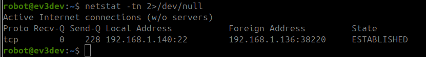

# Conectar EV3 a Red WiFi

1. Conectar el adaptador WiFi dongle al brick EV3. Se usa el **NETGEAR N150 Wireless WNA 1100**.

2. Encender el brick sin tarjeta SD, por lo que se inicia con el sistema operativo oficial de Lego.  
   Ir a configuración, activar la WiFi y buscar redes disponibles.  
   El adaptador encontrará redes: selecciona una e introduce la contraseña.

3. Para comprobar la conexión a internet:  
   Ve a **Ajustes > WiFi**, selecciona la red conectada.  
   Aparecerá una ventana con información como **MAC** e **IP**.
4. Desde el ordenador, conectado a la misma red que el EV3, haz `ping` a la IP del robot.  
   Si los paquetes se reciben correctamente, la conexión ha sido exitosa.

Apagar el brick EV3, insertar la tarjeta SD con el sistema operativo ev3dev y volver a encender. El brick encenderá con el nuevo sistema y ya estará conectado a la red WiFi.

<br>

# Cliente-Servidor con Sockets

Dado que la librería RPYC da error, se propone una arquitectura **Cliente-Servidor** usando **Sockets**:

- El robot actúa como **servidor**, escuchando en un puerto específico.
- El ordenador actúa como **cliente**, enviando datos a ese puerto.

Los archivos `client_pc.py` y `server_ev3.py` contienen ejemplos básicos para cada parte.

<br>

# Trabajar con la librería `ev3dev2` en VSCode
Esto evita que salgan warnings y errores en VSCode, aunque no es 
necesario porque el código se ejecutará en el robot, no en el ordenador.

Repositorio de ejemplo: [ev3dev/vscode-hello-python](https://github.com/ev3dev/vscode-hello-python)

Instalación dentro del entorno virtual:

```bash
pip install python-ev3dev2
```

<br>

# Cerrar la conexión TCP/IP por terminal
Si cerramos abruptamente con un CTRL+C los scripts, la conexión seguirá activa y el wifi dongle del EV3 seguirá parpadeando. 

Podemos comprobar las conexiones activas con: ```netstat -tn 2>/dev/null```.




<br>

# Conectarse vía SSH al robot y ejecutar scripts
En la terminal del ordenador:
```bash
ssh robot@ev3dev.local
```
o
```bash
ssh robot@DIRECCION_IP
```

La contraseña es ```maker```.

En la terminal del robot ejecutar: 
```bash 
python3 nombre_script.py
```

<br>

# Copiar ficheros PC-EV3 vía SSH
```bash
scp /path/to/local/file username@remote_ip:/path/to/remote/directory
```

```bash 
scp server_ev3.py robot@192.168.1.140:/home/robot
```